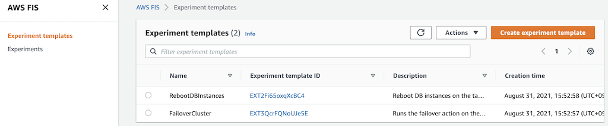
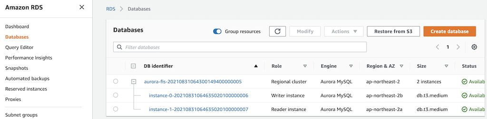
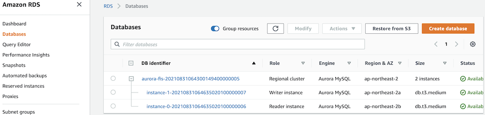

# AWS Fault Injection Simulator
[AWS Fault Injection Simulator](https://aws.amazon.com/fis/) is a fully managed service for running fault injection experiments on AWS that makes it easier to improve an application’s performance, observability, and resiliency. Fault injection experiments are used in chaos engineering, which is the practice of stressing an application in testing or production environments by creating disruptive events, such as sudden increase in CPU or memory consumption, observing how the system responds, and implementing improvements.

## Chaos Engineering
### Why Chaos Engineering
There are many reasons to do chaos engineering. We see teams transitioning in this way to reduce incidents, lower downtime costs, train their teams, and prepare for critical moments. Practicing chaos engineering allows you to detect problems before they become accidents and before customers are affected. And chaos engineering is useful for reducing downtime costs because it allows teams to have a resilient architecture. While the number of companies operating at Internet scale increases and high-traffic events such as sales or launches increase, the cost of downtime will become more expensive. Additionally, this continuous practice of chaos engineering gives teams more confidence every day as they build their own applications and systems. It takes less time to fire-fighting and more time to create and create value.

### How to do Chaos Engineering
To implement Chaos Engineering, one should follow the scientific method to implement experiments:
1. Observe your system
1. Baseline your metrics
1. Define Steady State
1. Form a Hypothesis with Abort Conditions (Blast Radius)
1. Run Experiment
1. Analyze Results
1. Expand Scope and Re-Test
1. Share Results

## Setup
[This](https://github.com/Young-ook/terraform-aws-aurora/blob/main/examples/fis/main.tf) is an example of terraform configuration file to create AWS Fault Injection Simulator experiments for chaos engineering. Check out and apply it using terraform command.

Run terraform:
```
terraform init
terraform apply
```
Also you can use the `-var-file` option for customized paramters when you run the terraform plan/apply command.
```
terraform plan -var-file tc1.tfvars
terraform apply -var-file tc1.tfvars
```

## Create Experiment Templates
This module automatically creates fault injection simulator experiment templates on your AWS account. Move to the AWS FIS service page on the AWS Management Conosol and select Experiment templates menu on the left. Then users will see the created experiment templates for chaos engineering.



## Run Experiments
To test your environment, select a experiment template that you want to run and click the `Actions` button on the right top on the screen. You will see `Start experiment` in the middle of poped up menu and select it. And follow the instructions.

### Failover DB Cluster
AWS FIS allows you to test resilience of Aurora DB cluster.

#### Update kubeconfig
Update and download kubernetes config file to local. You can see the bash command like below after terraform apply is complete. Copy this and run it to save the kubernetes configuration file to your local workspace. And export it as an environment variable to apply to the terminal.
```
bash -e .terraform/modules/eks/script/update-kubeconfig.sh -r ap-northeast-2 -n aurora-fis -k kubeconfig
export KUBECONFIG=kubeconfig
```

#### Define Steady State
Before we begin a failure experiment, we need to validate the user experience and revise the dashboard and metrics to understand that the systems are working under normal state, in other words, steady state.

#### Run Experiment
Go to the AWS FIS service page and select `FailoverDBCluster` from the list of experiment templates. Then use the on-screen `Actions` button to start the experiment.





## Clean up
Run terraform:
```
terraform destroy
```
Don't forget you have to use the `-var-file` option when you run terraform destroy command to delete the aws resources created with extra variable files.
```
terraform destroy -var-file tc1.tfvars
```
